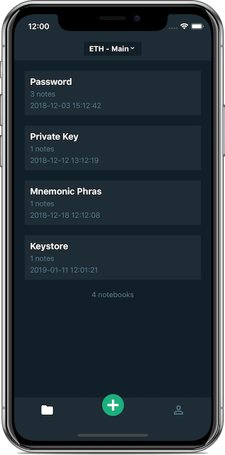
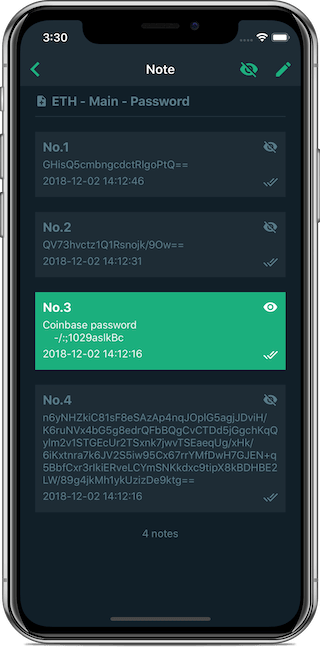
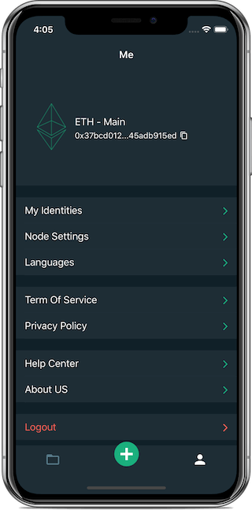
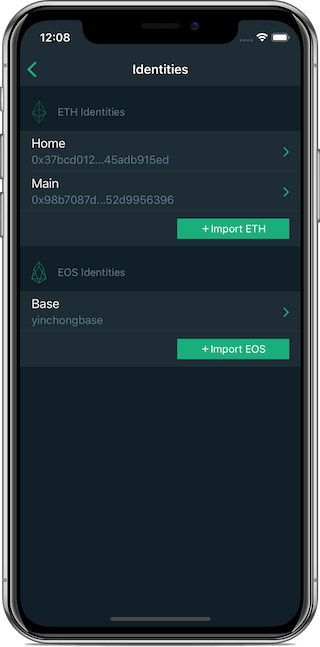
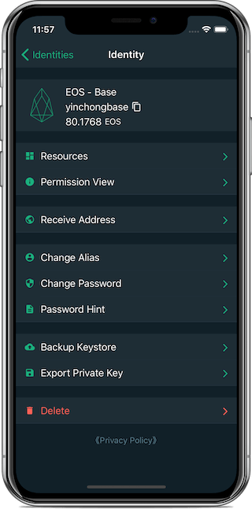

    

# BCNote is an encrypted note application developed based on blockchain technology
which provides encrypted note service with extremely high data security and reliability with the characteristics of blockchain technology.

## Support Android & iOS. Website: https://xrelease.cn

* **Main Functions**
1. Most importantly, BCNote is a decentralized DAPP. There is no centralized hardware or management organization in the system and no user information will be stored on the server.BCNote or anyone else can't access your notes. Only your identity private key can view the contents of the notes, and your identity private key can be stored in the mobile phone securely after being encrypted with the identity password you set.
2. Support Ethereum and EOS platforms. Users can choose to record their encrypted notes on their favorite platform.
3. The notes will be encrypted with your identity private key and aes-128 encryption algorithm. The encrypted notes will be stored transparently in the blockchain network, safe and reliable.
4. Create different notebooks to take notes and effectively manage various information.
5. Create identity, import identity, backup identity, export private key and other identity management functions.

* **If you are a blockchain user**
1. You may have many wallet passwords.
2. You may have various passwords of major digital currency exchanges.
3. you may have a lot of private keys, Keystore, mnemonic.

* **If you are not a blockchain user**
1. You probably have a lot of stock exchange passwords.
2. You may have many bank CARDS and credit card passwords.
3. You may have many online shopping, game, social and other passwords.

**How to safely and efficiently maintain the various important information must make you headache!**
**BCNote has found the perfect solution between the security of offline backup and the convenience of online backup, and we are born for it!**

--------

# BCNote是一款基于区款链技术开发的加密笔记应用
用区块链技术特性提供数据安全性和可靠性极高的加密笔记服务。
## 支持Android和iOS,下载地址: https://xrelease.cn

* **主要功能**
1. 最重要的，BCNote是一款去中心化的DAPP，体系不存在中心化的硬件或管理机构，不会在服务器上存储任何用户信息。BCNote或者其他任何人都不能访问您的笔记内容。只有您的身份私钥能查看笔记内容，同时您的身份私钥使用您设置的身份密码加密后安全的存储在手机中。
2. 支持Ethereum和EOS平台。用户可选择在自己喜欢的平台记录自己的加密笔记。
3. 笔记内容使用您的身份私钥进行加密，采用AES-128加密算法，加密后透明的存储在区块链网络中,安全可靠。
4. 创建不同的笔记本来记笔记，有效管理繁多信息。
5. 创建身份、导入身份、备份身份、导出私钥等身份管理功能。

* **如果您是区块链用户**
1. 您可能有很多钱包密码。
2. 您可能有各大数字货币交易所的各种密码。
3. 您可能有很多私钥、Keystore、助记词。

* **如果您是没有接触过区块链的用户**
1. 您可能有很多证券交易密码。
2. 您可能有很多银行卡、信用卡密码。
3. 您可能有很多在线的购物、游戏、社交等密码。

**如何安全高效的维护这繁多的重要信息一定让您头疼不已!** 
**BCNote在离线备份的安全性和在线备份的便捷性之间找到完美方案，我们为此而生！**

--------

# Donate 捐赠
**BTC:** 3JCqQHHKUeaHniMVFAVHw9vniwvdVviTrq

**ETH:** 0x4C38A591d58c698E43DdB16F928583f1F217A820

**EOS:** yinchongbase